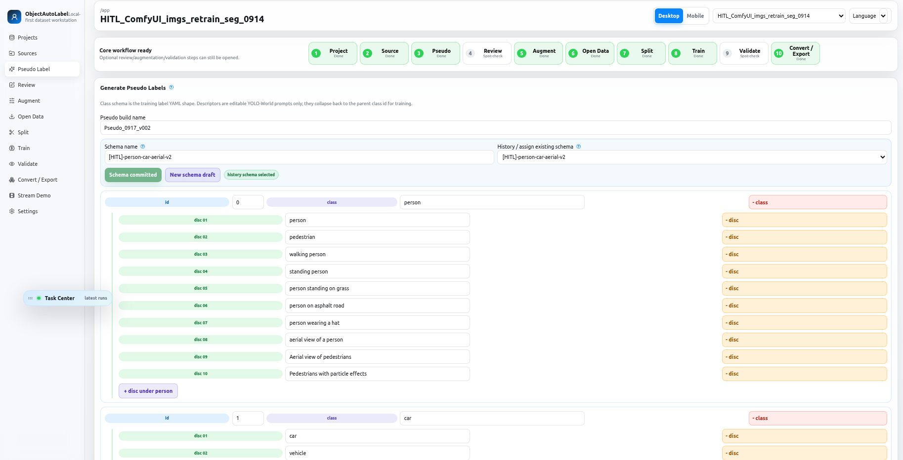

# ObjectAutoLabel

ObjectAutoLabel is a local-first object-detection dataset and model workflow. It runs a FastAPI backend, SQLite state, and a React/Vite WebUI for source registration, YOLO-World pseudo labeling, review, augmentation, split creation, YOLO training, validation, model conversion/export, and live stream inference.

Open the WebUI at:

```bash
http://127.0.0.1:8501/
```

## Interface Preview

[](https://a0665x.github.io/ObjectAutoLabel/)

[Open slideshow →](https://a0665x.github.io/ObjectAutoLabel/) — browse all five screens in one window with left/right navigation, a slide bar, and playback controls. GitHub README does not support interactive scripts, so the slideshow opens on a separate page.

## Start

### First installation

Use the launcher from the project root:

```bash
./run.sh
```

Choose `x86_64 / amd64` or `Jetson / aarch64` with the arrow keys and press
Enter. If the selected image is not installed, the launcher builds it with the
normal Docker layer cache, starts the service, and verifies API/CUDA access.

If the image already exists, bare `./run.sh` does not rebuild or start
anything. It prints the image id/creation time and points to the safe startup
and rebuild commands below.

### Normal startup after a reboot

```bash
./run.sh --up
```

`--up` uses the existing image and never rebuilds it. If the image is missing,
the command stops and asks you to run `./run.sh` for first installation.

### Rebuild after source or dependency changes

```bash
./run.sh --rebuild
```

`--rebuild` keeps Docker layer cache enabled, rebuilds the selected platform
image, starts it, and verifies API/CUDA access. It does not use `--no-cache` and
does not prune images, volumes, datasets, or models.

Useful commands:

```bash
./run.sh --status
./run.sh --logs
./run.sh --down
./run.sh --down_up
./run.sh --rebuild
./run.sh --detect
./run.sh --plan desktop
./run.sh --plan jetson
```

`--down_up` recreates the service from the existing image without rebuilding
the image.

`--plan` is a dry-run check. It prints the resolved runtime mode, architecture, compose file, and bind host without starting Docker.

## Runtime Modes

Desktop/x86_64:

```bash
./run.sh --mode desktop
./run.sh
```

Desktop mode uses `docker-compose.yml`, `Dockerfile`, and the x86 CUDA PyTorch base image.

Jetson/ARM64:

```bash
./run.sh --mode jetson
./run.sh
```

Jetson mode uses `docker-compose.jetson.yml`, `Dockerfile.jetson`, host networking, and NVIDIA ARM64 iGPU/L4T PyTorch images. The default Jetson base is `nvcr.io/nvidia/pytorch:25.06-py3-igpu`. Override when needed:

```bash
JETSON_BASE_IMAGE=nvcr.io/nvidia/l4t-pytorch:<tag> ./run.sh --rebuild
```

On Jetson, when `OBJECT_AUTOLABEL_BIND_HOST` is unset, `run.sh` detects the
primary LAN IPv4 and uses it (for example, `10.42.0.21`) so LAN access can
coexist with a Tailscale listener. Set `OBJECT_AUTOLABEL_BIND_HOST=<ip>` to
override that choice. The application verifies a configured non-loopback host
at startup and safely falls back to `127.0.0.1` if that address is no longer
bindable. Direct `docker compose` use without the launcher retains the compose
file's loopback default.

### Private Tailscale HTTPS

Start the WebUI, then publish only this app's dedicated HTTPS route to tailnet
members:

```bash
./run.sh --up
./run.sh --tailscale-up
./run.sh --tailscale-status
```

Use the printed `https://<device>.<tailnet>.ts.net:8501/` address rather than
a raw `100.x` address. When the app binds a LAN IP, its localhost proxy keeps
the Tailscale route targeting `127.0.0.1:8501`; when it binds loopback, Serve
targets the app directly. The launcher leaves shared port 443 and other routes
alone, and `--tailscale-down` removes only this exact 8501 proxy. It refuses
`--tailscale-up` if Funnel makes this exact hostname and port public, or if
Funnel status cannot be read; `--tailscale-status` reports public or unknown
access explicitly. Funnel routes on other ports do not affect this app route.
Confirm both
local and HTTPS health after a rebuild:

```bash
curl -fsS http://127.0.0.1:8501/api/health
curl -fsS https://<device>.<tailnet>.ts.net:8501/api/health
```

## Data Layout

- `data/projects/<slug>/`: project-owned workspace, copied sources, labels, splits, augmentations, models, conversions, and exports.
- `data/input/`: reusable raw input media. Project deletion does not remove these files.
- `data/opendata/visdrone2019-det/`: reusable verified VisDrone cache. `data/opendata/ultralytics/<owner>/<dataset>/` stores compatible Platform Detect caches. Project deletion removes only that project's mapped/sample import.
- `logs/YYYY-MM-DD/`: daily launcher, runtime, job, and selected access diagnostics.
- `world_model/`: YOLO-World `.pt`/`.pth` weights for Pseudo. Docker build does not download these weights.
- `input_model/`: YOLO `.pt`/`.pth` weights for Train.

## Optional Google, Facebook, or LINE Sign-in

OAuth sign-in uses Authlib inside the existing FastAPI process. Copy `.env.example` to `.env`, configure an exact public URL and at least one provider credential pair, set a random session secret of at least 32 characters, then enable authentication and rebuild the selected image:

```bash
cp .env.example .env
# Edit .env without committing provider secrets.
./run.sh --rebuild
```

Register these callback paths with the matching provider:

```text
<PUBLIC_URL>/api/auth/callback/google
<PUBLIC_URL>/api/auth/callback/facebook
<PUBLIC_URL>/api/auth/callback/line
```

When authentication is enabled but no provider is fully configured, the login screen shows setup guidance and protected APIs remain locked. Authentication identifies the operator but does not partition projects by user.
- `output_model/`: global compatibility/index surface. Project entries are symlinks to `data/projects/<slug>/output_model/`.

Deleting a project package removes its DB rows, jobs, project workspace, and project model-index entry. It does not delete raw `data/input/`.

### Install an open-vocabulary world model

Install the checksum-verified default YOLOE-26 Nano Seg checkpoint and prompt
encoders, or the checksum-verified YOLO-World v2 Small checkpoint:

```bash
scripts/install-world-model.sh
scripts/install-world-model.sh yolov8s-worldv2.pt
```

The installer verifies SHA-256 for both existing and downloaded catalog
artifacts before using them, then atomically renames verified downloads. A
custom asset URL must be paired with its explicit expected SHA-256 environment
variable. The current installer intentionally rejects YOLO-World v2 Medium,
Large, and Extra-Large because this repository has no locally attested catalog
hashes for them. Those filenames remain backend-recognized when an operator
manually supplies an approved trusted artifact through its own hash-controlled
workflow. Other compatible manually supplied weights may still be copied into
`world_model/`; the Pseudo page shows only supported filenames and refuses to
start without one.
The directory is bind-mounted read-only at `/app/world_model` inside the
container. Adding a weight file does not require rebuilding the Docker image;
refresh the Pseudo page to update its model list.

## Workflow

1. Create or select a project.
2. Sources: choose image folder or video, then run `Process & analysis`.
3. Pseudo: commit a class schema, name the pseudo build, and run YOLO-World.
4. Review: inspect the confidence map and adaptive object-size distribution, then spot-check/edit boxes. After zooming, drag empty image space to pan; Shift+drag selects boxes and dragging a box moves it. Right-click actions open beside the pointer. Labeled data remains trainable without checked/not-checked status gates.
5. Augment: choose `Skip augment` for a source/pass-through build, or create x3/x5/x8/x10 augmented builds.
6. Open Data (optional): use built-in VisDrone or paste one Ultralytics Platform Dataset URL. Compatible Detect datasets reuse the same class mapping, percentage, preview, Review, version and Split flow; other task types are blocked before download.
7. Split: choose the project source/augment condition and build or update Current Split. Active Open Data is added automatically while preserving official train/validation groups.
8. Train: name the run, choose the input model and optimizer (SGD, MuSGD, Adam, or AdamW), and watch box/class/DFL loss charts. Train automatically uses the valid Current Split; Review/Open Data changes require rebuilding it.
9. Validate: choose a current-project model source and run random-sample inference.
10. Convert / Export: on x86_64, create ONNX FP32 and/or LiteRT FP32 conversion packages with schema metadata and Netron preview, then download one structured ZIP containing native PT, converted artifacts, training evidence, arguments, classes, and metadata. On Jetson/aarch64, copy the `.pt` checkpoint to an x86_64 host and convert it there.
11. Stream Demo: run a supported PT, ONNX, or LiteRT artifact against a host camera or uploaded video with live confidence and IoU controls.

Producing steps retain lineage. Open Data is one active import per project, and new training intentionally exposes only one Current Split to avoid ambiguous runtime choices.

Model conversion is intentionally x86_64 FP32-only. Converter dependencies are installed when the desktop image is built, and Ultralytics package auto-install is disabled; a conversion request never installs packages at runtime. Existing historical package rows remain readable even if they contain formats or precisions that are no longer offered for new conversions.

## Settings

The Settings page is the workflow control center:

- Workflow defaults: pseudo model, train input model, augment default, split ratio, train device.
- Project storage: active project folder and artifact counts.
- Runtime deployment: Desktop x86_64 vs Jetson ARM64 guidance.
- Model inventory: world, input, and output model lists.

Settings defaults are UI conveniences. Each workflow tab still shows the exact build input before running.

### Reproducible CUDA training

For a bounded acceptance run, use one isolated project per lineage, register a
source only once, and keep generated pseudo labels, splits, and weights inside
that project. The retained 0629 example is documented in
[the dual-training acceptance report](docs/verification/2026-08-30-0629-dual-training-acceptance.md).

Its approved input is `yolov8n_pretrain_8020.pt`, with one epoch, image size
640, batch 8, CUDA, patience 10, SGD, `lr0=0.01`, and `lrf=0.01`. For the
final audited retry, the API request explicitly used `rect=false` and
`amp=false`. Those API fields default to `true`; use `diagnostics=true` only
for a focused investigation, because it adds aggregate optimizer/gradient/EMA
evidence to the job result without changing the selected model. Always retain
the run record, `args.yaml`, metrics, `best.pt`, `last.pt`, and validation
preview before choosing a model for deployment.

### Responsive Review controls

At narrow widths the Review toolbar uses two rows: view and save actions
first, then Select/Draw/Pan and shortcuts. The groups stack below 900px,
ordinary controls retain 44px touch targets, and short panel actions stay
content-sized above 480px. At 480px and below, primary panel actions may fill
the available width. Long active-project names wrap rather than creating page
overflow.

## Verification

Common local checks:

```bash
bash -n run.sh scripts/detect-runtime.sh scripts/verify-runtime.sh
pytest -q
npm --prefix frontend test
npm --prefix frontend run build
```

Verify the running service and CUDA:

```bash
scripts/verify-runtime.sh --quick jetson
```

Run a bounded one-epoch YOLO CUDA training smoke test:

```bash
scripts/verify-runtime.sh --train jetson
```

The training smoke test uses the smallest local `.pt` file in `input_model/`;
it never downloads weights or falls back to CPU.

Dependency files are platform-specific: `requirements.txt` is for the
x86_64/desktop CUDA image and includes its FP32 conversion stack, while
`requirements-jetson.txt` keeps Jetson's NVIDIA PyTorch-compatible
`numpy>=1.26,<2` and bounded OpenCV version without the conversion stack. Do
not copy one file over the other; rebuild the selected image after
intentionally changing its dependency file. Neither runtime installs converter
packages on demand.
